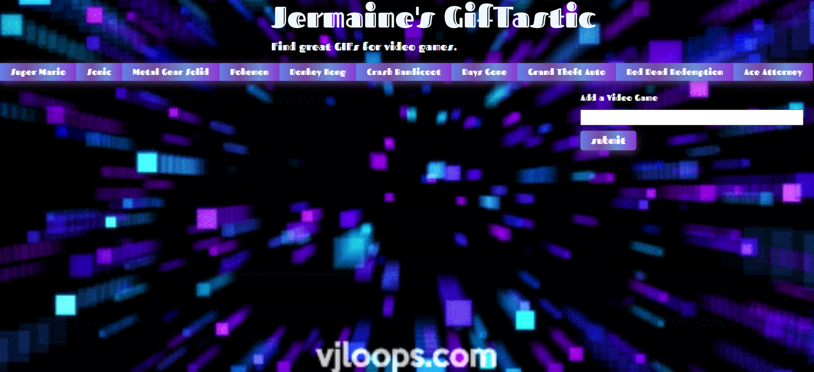
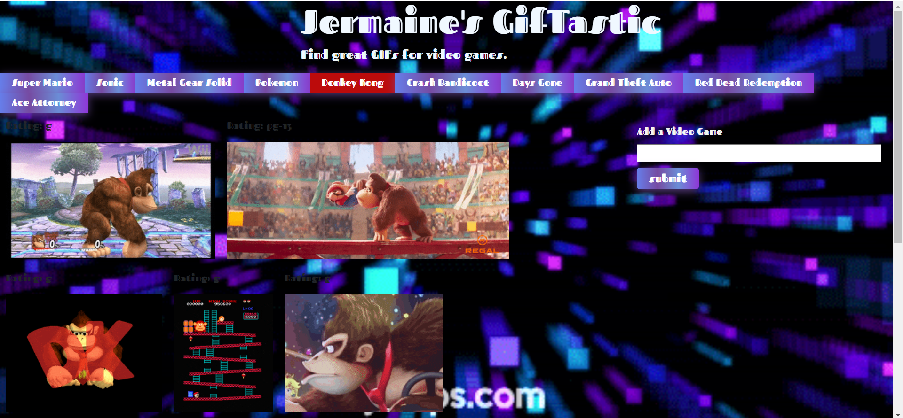
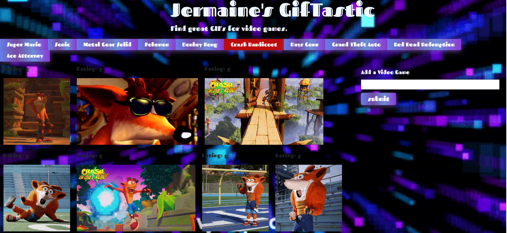

# GifTastic
In this application, the user can click on any on the buttons in the navigator.
The app will then display GIfs(animated images) in the body on the app: based on the button the user clicked. The user can also add a button to the navbar in the search engine tho generate more GIFs. For access to app click
[here](https://ausar1989.github.io/GifTastic/)

# Screenshots of The App
This is an image before a button is clicked:

This is an image of Donkey Kong GIFs:

This is an image of an Crash Bandicoot GIFs:

# Technologies Used:
- HTML
- CSS
- Javascript
- jQuery
- Bootstrap
- Axios